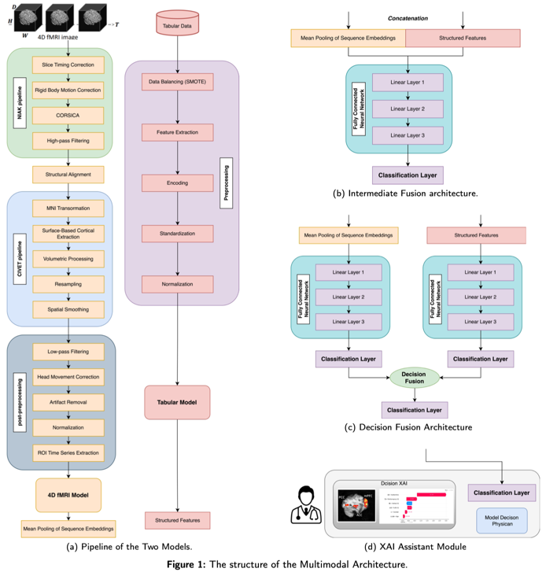
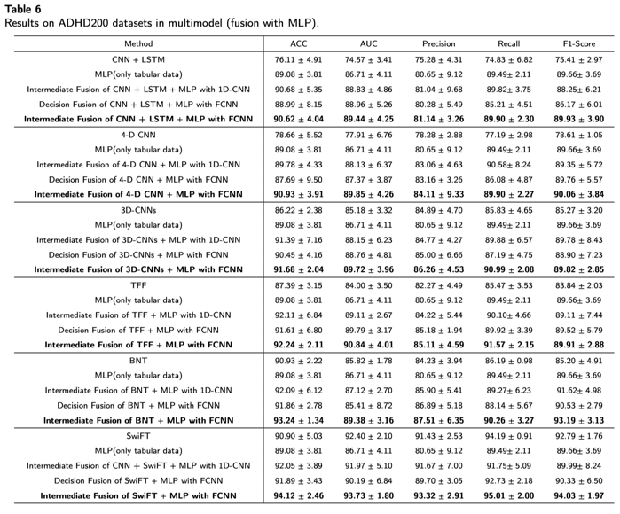
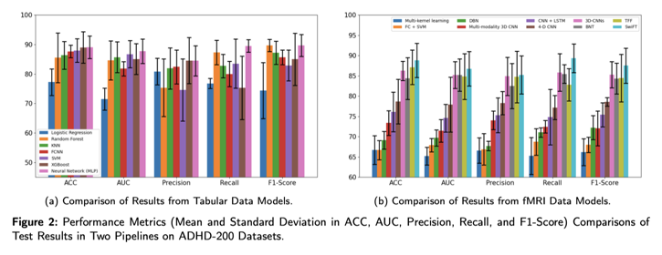
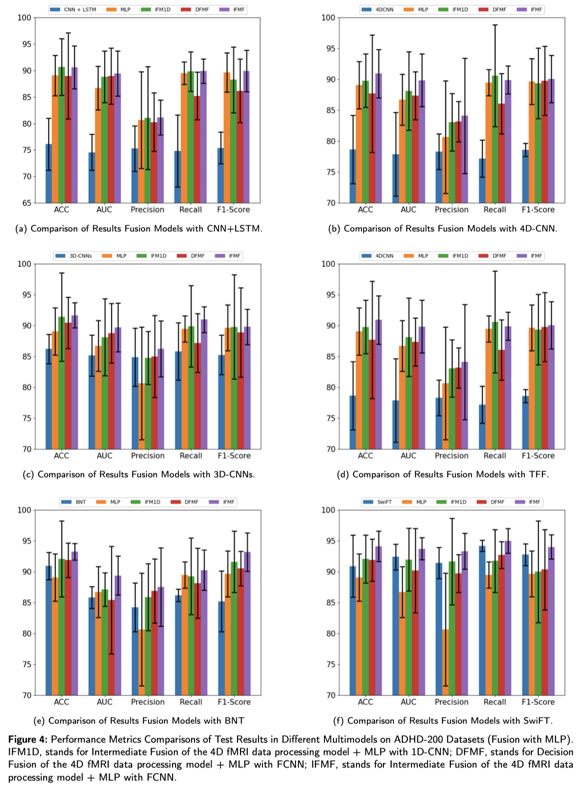
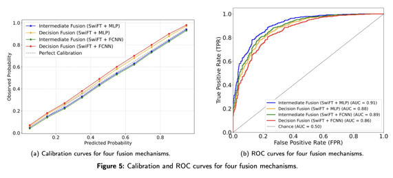
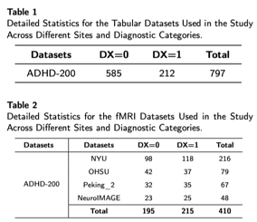

  # 4DViTADHD


This repository contains the implementation and experimental code for the research work presented in the paper:

**Multimodal Intermediate Fusion for ADHD Diagnosis using 4D Vision Transformer**

The proposed framework integrates high-dimensional 4D fMRI data with structured clinical and demographic (tabular) data to improve the diagnostic accuracy of ADHD. It leverages advanced deep learning architectures, including a 4D Vision Transformer (SwiFT) for fMRI processing and a Multilayer Perceptron (MLP) for tabular data, combined via intermediate fusion strategies. Additionally, explainable AI techniques are applied to enhance model interpretability.

## Overview

- **Multimodal Data Integration:** Combines 4D fMRI and tabular data to capture both brain activity and clinical/behavioral information.
- **Fusion Strategies:**
    - *Intermediate Fusion* – Merges features from both modalities before final classification.
    - *Decision Fusion* – Combines predictions from separate models.
- **Explainable AI:** Uses SHAP and Integrated Gradients with Smoothgrad Square (IG-SQ) to reveal key brain regions and clinical features impacting the diagnosis.


## Figures

Below are some key figures from the study that illustrate the framework and its components:

- **Multimodal Architecture Overview**  
  

- **Intermediate Fusion Strategy**  
  

- **Decision Fusion Strategy**  
  

- **XAI Assistant Module**  
  

- **4D fMRI Data Preprocessing Pipeline**  
  

- **Tabular Data Processing Module**  
  

## Installation

1. **Clone the repository:**

   ```bash
   git clone https://github.com/your_username/adhd-diagnosis.git

## Datasets

The datasets used in this study are:
1. **ADHD-200**: A multi-site collection aimed at understanding ADHD through brain imaging and related behavioral outcomes. <http://preprocessed-connectomes-project.org/adhd200/>


The detailed statistics for the fMRI datasets used in the study are as follows:



## Code Structure

The repository is organized as follows:

```
MIF_for_ADHD/
├── configs/
│   ├── 4DVitADHD/
│   ├── 4DVitADHD_pp/
├── data/
│   ├── FMRI_data/
│   │   ├── ADHD/
│   ├── preprocessed_data/
│   │   ├── ADHD/
│   ├── split/
│   │   ├── ADHD/
│   ├── tabular/
├── models/
│   ├── utils/
│   │   ├── 4D_VitADHD.py 
│   │   ├── init.py
│   │   ├── build.py
│   ├── VitADHD.py
├── .gitignore
├── LICENSE
├── README.md
```

## Installation

To install the required dependencies, run:
```bash
# clone project   
git clone https://github.com/InfoLab-SKKU/4DfCF.git

# install project   
cd MISFM
conda env create -f configs/4DVitADHD/base_patch4_group7_224.yaml
conda activate py39
```

[//]: # ()
[//]: # (## Citation)

[//]: # ()
[//]: # (If you use this code or data in your research, please cite the corresponding paper.)

[//]: # (```)

[//]: # (@article{Zheng2020,)

[//]: # (  title={4DfCF: 4D fMRI CrossFormer Vision Transformer},)

[//]: # (  author={Chensheng Zheng and others},)

[//]: # (  journal={IEEE Transactions on Medical Imaging},)

[//]: # (  volume={XX},)

[//]: # (  number={XX},)

[//]: # (  year={2020},)

[//]: # (})

[//]: # (```)
