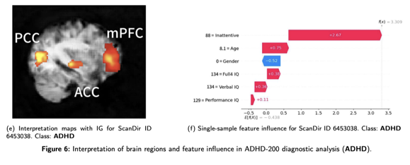

# 4DViTADHD


This repository contains the implementation and experimental code for the research work presented in the paper:

**Multimodal Intermediate Fusion for ADHD Diagnosis using 4D Vision Transformer**

The proposed framework integrates high-dimensional 4D fMRI data with structured clinical and demographic (tabular) data to improve the diagnostic accuracy of ADHD. It leverages advanced deep learning architectures, including a 4D Vision Transformer (SwiFT) for fMRI processing and a Multilayer Perceptron (MLP) for tabular data, combined via intermediate fusion strategies. Additionally, explainable AI techniques are applied to enhance model interpretability.

## Overview

- **Multimodal Data Integration:** Combines 4D fMRI and tabular data to capture both brain activity and clinical/behavioral information.
- **Fusion Strategies:**
    - *Intermediate Fusion* – Merges features from both modalities before final classification.
    - *Decision Fusion* – Combines predictions from separate models.
- **Explainable AI:** Uses SHAP and Integrated Gradients with Smoothgrad Square (IG-SQ) to reveal key brain regions and clinical features impacting the diagnosis.


## Figures

Below are some key figures from the study that illustrate the framework and its components:

- **Multimodal Architecture Overview**  
  This study presents a multimodal architecture that integrates 4D fMRI imaging data and structured tabular data to improve the accuracy of ADHD diagnosis.
  The architecture consists of two main branches: one to process high-dimensional 4D fMRI data, which captures the
  spatio-temporal dynamics of brain activity, and the other to
  process structured tabular data, which includes clinical and
  demographic information, such as age, gender, behavioral
  scores, and IQ metrics. 
  Once feature extraction is complete, the model uses
  two fusion strategies to integrate the information from both
  branches. 
  Finally, XAI techniques are employed to enhance the interpretability of the diagnostic framework.
  

- **Results on Different Multimodal Settings**  
  When comparing MLP and XGBoost for processing tabular data within the multimodal setting, MLP consistently demonstrated better integration with deep learning-based fMRI feature extractors.
  

- **Performance Metrics Comparisons**

  Performance Metrics Comparisons of Test Results in Different Multimodels on ADHD-200 Datasets (Fusion with MLP). IFM1D, stands for Intermediate Fusion of the 4D fMRI data processing model + MLP with 1D-CNN; DFMF, stands for Decision Fusion of the 4D fMRI data processing model + MLP with FCNN; IFMF, stands for Intermediate Fusion of the 4D fMRI data processing model + MLP with FCNN.
  
    

- **XAI Assistant Module**

  In this study, we utilized IG-SQ and SHAP methods within the Captum framework to analyze key features across multimodal data, enhancing the interpretability of our ADHD diagnosis model. Figures and illustrate the feature analysis for ADHD and Normal samples across different modalities (fMRI and tabular data), highlighting the practical diagnostic significance of our model.
  
  


## Installation

1. **Clone the repository:**

   ```bash
   git clone https://github.com/your_username/adhd-diagnosis.git

## Datasets

The datasets used in this study are:
1. **ADHD-200**: A multi-site collection aimed at understanding ADHD through brain imaging and related behavioral outcomes. <http://preprocessed-connectomes-project.org/adhd200/>


The detailed statistics for the fMRI datasets used in the study are as follows:


## Code Structure

The repository is organized as follows:

```
MIF_for_ADHD/
├── configs/
│   ├── 4DVitADHD/
│   ├── 4DVitADHD_pp/
├── data/
│   ├── FMRI_data/
│   │   ├── ADHD/
│   ├── preprocessed_data/
│   │   ├── ADHD/
│   ├── split/
│   │   ├── ADHD/
│   ├── tabular/
├── models/
│   ├── utils/
│   │   ├── 4D_VitADHD.py 
│   │   ├── init.py
│   │   ├── build.py
│   ├── VitADHD.py
├── .gitignore
├── LICENSE
├── README.md
```

## Installation

To install the required dependencies, ru
```bash
# clone project   
git clone https://github.com/InfoLab-SKKU/4DViTADHD.git

# install project   
cd 4DVitADHD
conda env create -f configs/4DVitADHD/base_patch4_group7_224.yaml
conda activate py39
```

[//]: # ()
[//]: # (## Citation)

[//]: # ()
[//]: # (If you use this code or data in your research, please cite the corresponding paper.)

[//]: # (```)

[//]: # (@article{Zheng2020,)

[//]: # (  title={4DfCF: 4D fMRI CrossFormer Vision Transformer},)

[//]: # (  author={Chensheng Zheng and others},)

[//]: # (  journal={IEEE Transactions on Medical Imaging},)

[//]: # (  volume={XX},)

[//]: # (  number={XX},)

[//]: # (  year={2020},)

[//]: # (})

[//]: # (```)
